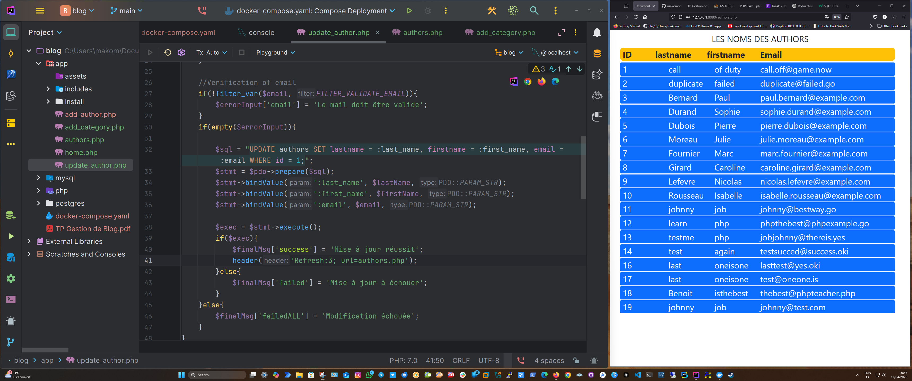

# 📝 Blog Management System



## 🎯 Objective

This project aims to familiarize you with CRUD operations (Create, Read, Update, Delete) using PHP and MySQL. You'll create, read, update, and delete data within a blog database.

## 🛠️ Prerequisites

Before starting, ensure you have the following installed on your machine:

- **PHP**: Server-side scripting language used for backend development.
- **MySQL**: Relational database management system for storing data.
- **Docker**: Containerization platform to run PHP and MySQL in isolated environments.

## 📌 Project Steps

### Step 1: Database Configuration

1. Create a `dbconnect.php` file inside an `includes` folder to establish a connection to the database.
2. Set up the database by accessing:  
   [http://127.0.0.1:8080/install/install.php](http://127.0.0.1:8080/install/install.php)

### Step 2: CRUD Operations

#### ✅ Create

- **Add a New Author**  
  Implement an HTML form to add a new author.

- **Add a New Category**  
  Implement an HTML form to add a new category.

#### 👁️ Read

- **Display List of Authors**  
  Show a list of authors on `authors.php` using an HTML table.

- **Display List of Posts**  
  Show a list of posts on `index.php` using semantic HTML.

#### 🔄 Update

- **Edit an Author**  
  Create a pre-filled HTML form with an existing author's information to update their details in the database.

- **Edit a Category**  
  Create a pre-filled HTML form with an existing category's information to update its details in the database.

#### ❌ Delete

- **Delete an Author**  
  Add a "Delete" button next to each author in the list. Clicking this button removes the author from the database.

- **Delete a Category**  
  Add a "Delete" button next to each category in the list. Clicking this button removes the category from the database.

### Step 3: Advanced Operations

- **View Post Details**  
  Create a page to display details of a specific post.

- **View Posts by a Specific Author**  
  Create a page to display posts by a specific author.

- **View Posts by a Specific Category**  
  Create a page to display posts in a specific category.

- **Add a Comment to a Post**  
  Implement an HTML form to add a comment to a specific post.

## 📁 Project Structure


## 🚀 Installation

1. Clone this repository to your local machine.

   ```bash
   git clone https://github.com/makombelajob/blog_PHP_MYSQL.git
   cd blog_PHP_MYSQL
   docker compose up

    Launch your Docker environment for PHP and MySQL.

    Navigate to http://127.0.0.1:8080/install/install.php to set up the database.

    Once the database is set up, you can start using the application.

🤝 Contributing

Contributions are welcome! If you'd like to improve this project, feel free to open a pull request.
📄 License

This project is licensed under the MIT License. See the LICENSE file for more details.